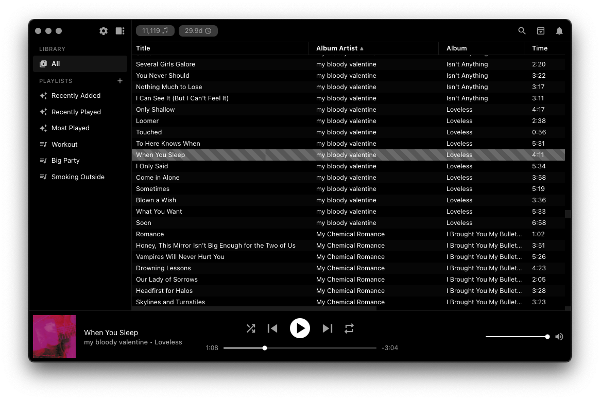
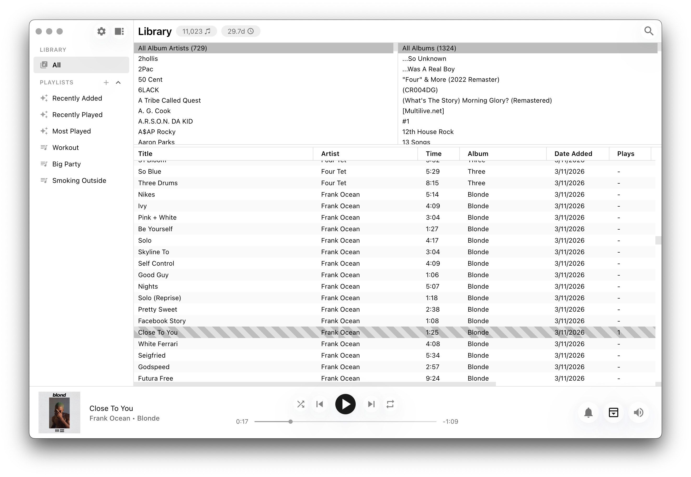
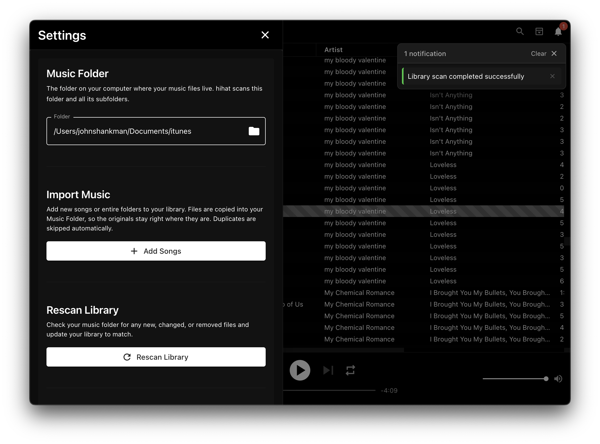
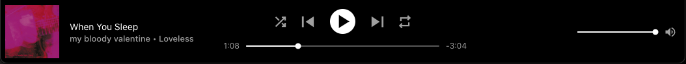
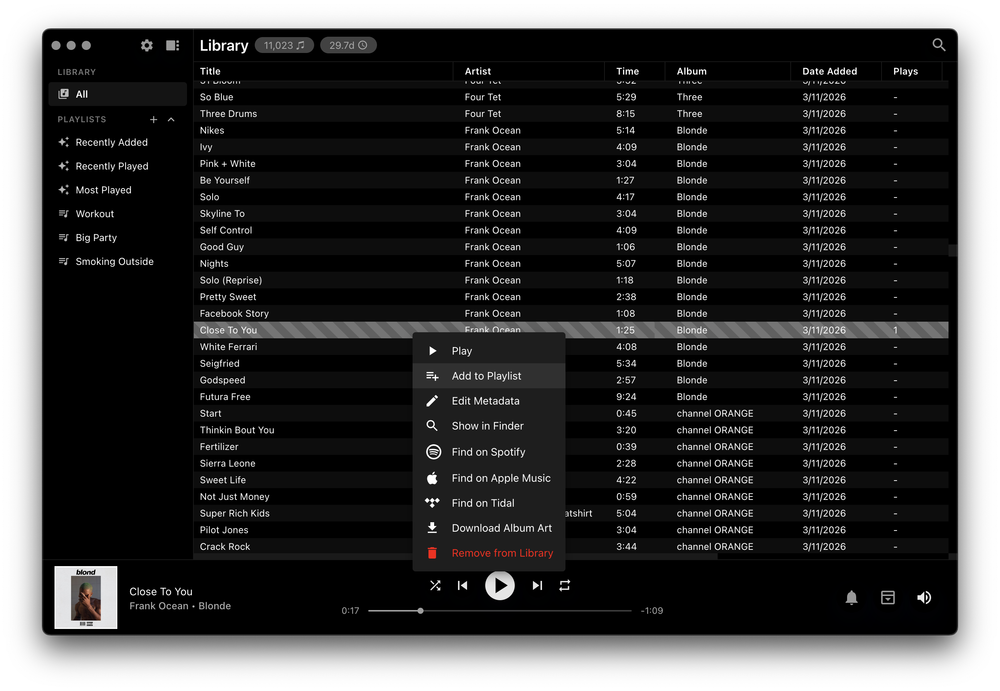
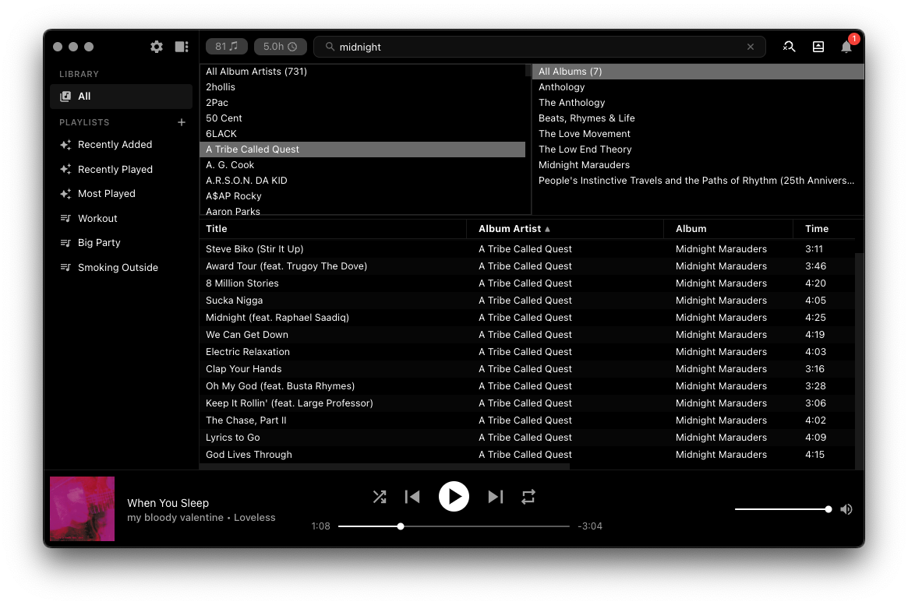
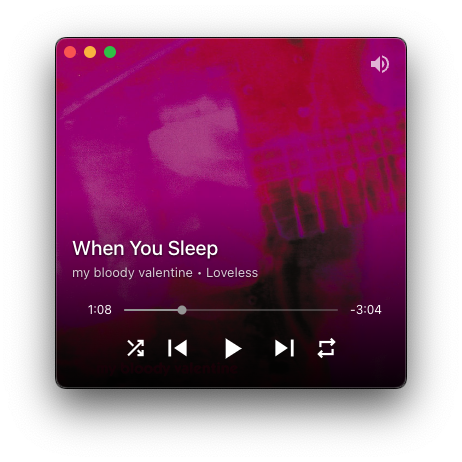
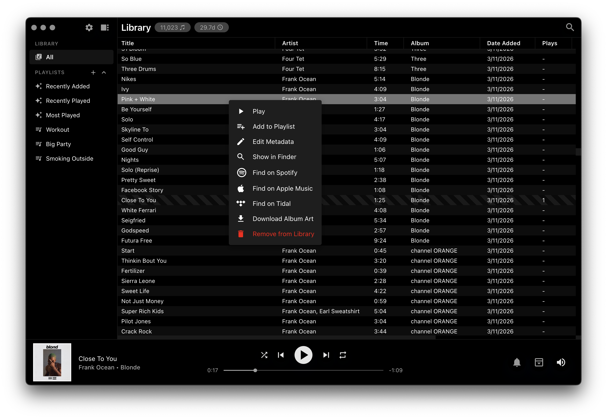
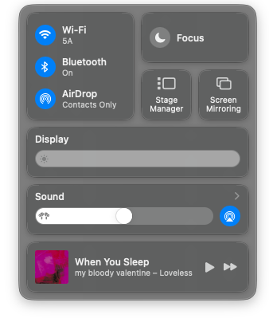

<a name="readme-top"></a>

<br />
<div align="center">
  <a href="https://github.com/johnnyshankman/hihat">
    
  </a>

  <h3 align="center">hihat</h3>

  <p align="center">
    The minimalist offline music player for macOS
    <br />
    <br />
    <a href="https://github.com/johnnyshankman/hihat/releases/latest">Download</a>
    ·
    <a href="https://github.com/johnnyshankman/hihat/issues">Report Bug</a>
    ·
    <a href="https://github.com/johnnyshankman/hihat/issues">Request Feature</a>
  </p>
  <p align="center">
    
  </p>
</div>



## Table of Contents

1. [About The Project](#about-the-project)
2. [Features](#features)
3. [Supported Audio Formats](#supported-audio-formats)
4. [Getting Started](#getting-started)
    - [Installing hihat](#installing-hihat)
    - [First Time Setup](#first-time-setup)
    - [Updating hihat](#updating-hihat)
5. [Using hihat](#using-hihat)
    - [Playing Music](#playing-music)
    - [Sidebar and Navigation](#sidebar-and-navigation)
    - [Playlists](#playlists)
    - [Browsing and Filtering](#browsing-and-filtering)
    - [Mini Player](#mini-player)
    - [Right-Click Actions](#right-click-actions)
    - [Settings and Preferences](#settings-and-preferences)
    - [Keyboard Shortcuts](#keyboard-shortcuts)
6. [Tips](#tips)
7. [Roadmap](#roadmap)
8. [Built With](#built-with)
9. [Contributing](#contributing)
10. [Getting Started as a Contributor](#getting-started-as-a-contributor)
11. [Looking for Something Like WinAmp?](#looking-for-something-like-winamp)
12. [License](#license)
13. [Contact](#contact)

## About The Project

**hihat** is a free, open-source music player for macOS built for people who keep a local music library. It plays every major audio format with true gapless playback, manages libraries of any size, and stays out of your way with a clean dark-mode interface. No ads, no accounts, no internet required — just your music.

<p align="right">(<a href="#readme-top">back to top</a>)</p>

## Features

**Library Management**
* Import any folder structure — hihat finds all music files recursively
* Smart deduplication on import (prefers higher-quality files)
* Fast library scanning (~1 minute per 10,000 songs)
* Library stats: total songs, size in GB, total plays, and total hours (via the hihat menu)
* Incremental library backup to any external drive

**Playback**
* True gapless playback
* Shuffle with navigable history (up to 100 tracks)
* Repeat modes: off, single track, or all
* Play count tracking with duration-based threshold
* Last Played date tracking

**Organization**
* User-created playlists — create, rename, delete, and add or remove tracks
* Smart playlists: Recently Added, Recently Played, and Most Played (top 50 each, updated automatically)
* Browser panel for filtering by album artist and album
* Sort by any column: Title, Artist, Album, Album Artist, Genre, Time, Play Count, Date Added, Last Played
* Quick search bar — filter by title, artist, album, or genre
* Customizable column visibility — right-click any column header
* Drag-and-drop column reordering
* Drag and drop tracks to sidebar playlists
* Per-view search filters preserved across navigation
* Persistent sorting preferences per playlist
* Persistent column widths

**Interface**
* Dark and Light themes
* Mini Player mode — a floating window with album art
* Frameless macOS-native window with traffic light controls
* Collapsible sidebar navigation
* Multi-select with bulk operations (Cmd+Click, Shift+Click)
* Scrolling marquee for long track and artist names
* Responsive design down to 540px

**Integration**
* macOS media keys, keyboard, and Bluetooth headphone support
* macOS menu bar with playback controls and keyboard shortcuts
* macOS Now Playing widget integration
* Find on Spotify, Apple Music, and Tidal in one click
* Download album art from any track
* Show any track's file in Finder



<p align="right">(<a href="#readme-top">back to top</a>)</p>

## Supported Audio Formats

Almost every format under the sun is supported, and they can all be mixed together in the same library:

* MP3
* MP4/M4A
* AAC
* WAV
* FLAC
* ALAC
* Opus
* Ogg Vorbis
* PCM

For detailed format information, see:
* [The Chromium Project](https://www.chromium.org/audio-video/) for supported audio formats
* [Music Metadata](https://github.com/borewit/music-metadata#features) for supported metadata formats

#### Limitations
* hihat does not play online streams
* hihat does not play protected content (M4P, AAX)
* hihat does not display album art for formats that do not embed it (WAV)

<p align="right">(<a href="#readme-top">back to top</a>)</p>

## Getting Started

### Installing hihat

1. Download the `.dmg` file from the [Latest Release](https://github.com/johnnyshankman/hihat/releases/latest)
2. Double-click the `.dmg` to open it, then drag **hihat** into your Applications folder

> **Note:** The first time you open hihat, macOS will warn you it's from an unidentified developer and ask you to confirm. This is expected — hihat is free and does not pay for an Apple Developer License to suppress this dialog.

### First Time Setup

1. Open hihat
2. Click the **Settings** icon (gear) in the top-right corner of the sidebar
3. Under **Music Folder**, click the folder icon to select the folder where you store your music
4. Confirm you want to scan the folder
5. Wait for the import to complete (about 1 minute per 10,000 songs)
6. Your library is ready — start playing!



### Updating hihat

1. Download the latest `.dmg` from the [Releases](https://github.com/johnnyshankman/hihat/releases/latest) page
2. Drag the new **hihat** into your Applications folder and confirm the replacement
3. Open hihat — your library, playlists, play counts, and settings are all preserved

<p align="right">(<a href="#readme-top">back to top</a>)</p>

## Using hihat

### Playing Music

Double-click any track in the library to start playing. The player bar at the bottom of the window shows:

* **Album art** on the left (click to open the Mini Player)
* **Track title and artist** in the center (click the title to scroll back to the current song)
* **Playback controls**: previous, play/pause, next, repeat, and shuffle
* **Seek slider** to scrub through the track
* **Volume control** on the right



### Sidebar and Navigation

The sidebar on the left is your main navigation:

* **All** — click to view your entire music library
* **Playlists** — your user-created playlists and smart playlists (marked with a sparkle icon)
* **Settings icon** (gear) — opens the Settings drawer
* **Toggle** — collapse or expand the sidebar with the toggle button, or press `Cmd+S`


### Playlists

**Creating a playlist:**
Click the **+** icon next to the "Playlists" header in the sidebar, type a name, and hit Create.

**Adding tracks to a playlist:**
Right-click any track and select **Add to Playlist**, then choose which playlist. You can also multi-select tracks (Cmd+Click or Shift+Click), right-click, and choose **Add All to Playlist**. Alternatively, drag and drop tracks directly onto any playlist in the sidebar.

**Smart playlists:**
Three built-in smart playlists update automatically:
* **Recently Added** — your 50 most recently imported tracks
* **Recently Played** — your 50 most recently played tracks
* **Most Played** — your 50 most played tracks

**Managing playlists:**
Right-click any user-created playlist in the sidebar to **Rename** or **Delete** it.



### Browsing and Filtering

**Search:** Click the search icon in the toolbar (or just start typing when focused on the library) to filter tracks by title, artist, album, or genre.

**Browser:** Click the people icon in the toolbar to open the Browser panel on the right. It has two columns — Album Artist and Album — so you can drill down by artist and then by album. Click any item to filter; click it again to deselect.

**Sorting:** Click any column header to sort ascending or descending.

**Column visibility:** Right-click any column header to show or hide columns (Title, Artist, Album, Album Artist, Genre, Time, Play Count, Date Added, Last Played).



### Mini Player

Click the album art in the player bar to open the Mini Player — a compact floating window that stays on top of other apps. It displays the album art as a full background with playback controls overlaid at the bottom. All controls work: play/pause, skip, previous, seek, volume, shuffle, and repeat.



### Right-Click Actions

Right-click any track to access:

* **Play** — play this track immediately
* **Add to Playlist** — add to any of your playlists
* **Show in Finder** — reveal the audio file in macOS Finder
* **Find on Spotify** — search for this track on Spotify
* **Find on Apple Music** — search for this track on Apple Music
* **Find on Tidal** — search for this track on Tidal
* **Download Album Art** — save the embedded album art as an image
* **Remove from Library** — remove the track from hihat and move the file to Trash

When viewing a playlist, the delete option becomes **Remove from Playlist** (the file stays in your library).

When multiple tracks are selected (Cmd+Click or Shift+Click), right-click to:
* **Add All to Playlist** — bulk add selected tracks
* **Remove from Library** — bulk remove selected tracks



### Settings and Preferences

Click the gear icon in the sidebar to open the Settings drawer:

* **Music Folder** — change where hihat looks for your music (triggers a full rescan)
* **Import Music** — add new songs or folders to your library
* **Rescan Library** — scan your existing library folder for new or changed files
* **Backup Library** — incremental backup to any external drive (only copies new and changed files)
* **Appearance** — toggle between Dark and Light themes
* **Column Visibility** — show or hide table columns (also available by right-clicking any column header)
* **Reset** — start fresh by clearing play counts, playlists, and settings. Your music files are never touched.


### Keyboard Shortcuts

| Action | Shortcut |
|--------|----------|
| Next Track | `Cmd+Right` |
| Previous Track | `Cmd+Left` |
| Volume Up | `Cmd+Up` |
| Volume Down | `Cmd+Down` |
| Toggle Shuffle | `Cmd+=` |
| Toggle Repeat | `Cmd+R` |
| Toggle Sidebar | `Cmd+S` |
| Toggle Full Screen | `Ctrl+Cmd+F` |

hihat also responds to **media keys** on your keyboard and **Bluetooth headphones**, and integrates with the **macOS Now Playing** widget for play/pause, skip, and previous controls.



<p align="right">(<a href="#readme-top">back to top</a>)</p>

## Tips

* Click the **song name** or **album art** in the player bar to scroll back to the currently playing track
* Try **resizing the window** — hihat adapts to all sorts of sizes, including a compact view at narrow widths
* Use **Cmd+Click** or **Shift+Click** to select multiple tracks for bulk operations
* Check the **hihat** menu in the menu bar for library stats
* Smart playlists are a great way to rediscover music you haven't listened to in a while

<p align="right">(<a href="#readme-top">back to top</a>)</p>

## Roadmap

- [ ] Edit song metadata
- [ ] Queue a next-up song

See the [open issues](https://github.com/johnnyshankman/hihat/issues) for a full list of proposed features and known issues.

<p align="right">(<a href="#readme-top">back to top</a>)</p>

## Built With

* [![Electron][Electron.js]][Electron-url]
* [![React][React.js]][React-url]
* [![Typescript][Typescript.js]][Typescript-url]
* [![Google Material UI][MaterialUI.js]][MaterialUI-url]
* [![zustand][zustand.js]][zustand-url]
* [![Tailwind][Tailwind.js]][Tailwind-url]
* [![Music Metadata][MusicMetadata.js]][MusicMetadata-url]
* [![TanStack Table][TanStackTable.js]][TanStackTable-url]
* [![Gapless 5][Gapless5.js]][Gapless5-url]

<p align="right">(<a href="#readme-top">back to top</a>)</p>

## Contributing

Contributions are what make the open source community such an amazing place to learn, inspire, and create. Any contributions you make are **greatly appreciated**.

If you have a suggestion that would make this better, please fork the repo and create a pull request. You can also simply open an issue with the tag "enhancement".
Don't forget to give the project a star! Thanks again!

1. Fork the Project
2. Create your Feature Branch (`git checkout -b feature/AmazingFeature`)
3. Commit your Changes (`git commit -m 'Add some AmazingFeature'`)
4. Push to the Branch (`git push origin feature/AmazingFeature`)
5. Open a Pull Request

<p align="right">(<a href="#readme-top">back to top</a>)</p>

## Getting Started as a Contributor

### Prerequisites

* Node v20+
  ```sh
  brew install nvm
  nvm install v20
  nvm use v20
  ```

* npm v10+
  ```sh
  npm install npm@latest -g
  ```

### Installation

1. Clone the repo
   ```sh
   git clone https://github.com/johnnyshankman/hihat.git
   ```
2. Install dependencies
   ```sh
   npm install
   ```

### Available Scripts

```sh
npm run start          # Dev mode with hot reload
npm run build          # Production build (main + renderer)
npm run lint           # ESLint check
npm run lint:fix       # ESLint auto-fix
npm run typecheck      # TypeScript type checking
npm run test           # Jest unit tests
npm run test:e2e       # Playwright E2E tests
npm run package        # Build + package Electron app
```

<p align="right">(<a href="#readme-top">back to top</a>)</p>

## Looking for Something Like WinAmp?

I highly suggest [Aural](https://github.com/kartik-venugopal/aural-player) for that experience! It's no longer in development but works perfectly.

## Looking for Windows support?

How'd you end up here? [MusicBee](https://getmusicbee.com/) is great and free but is not open source.

## License

Distributed under the MIT License. See `LICENSE` for more information.

## Contact

Johnny aka White Lights - [@iamwhitelights](https://twitter.com/iamwhitelights)

Project Link: [https://github.com/johnnyshankman/hihat](https://github.com/johnnyshankman/hihat)

<p align="right">(<a href="#readme-top">back to top</a>)</p>

<!-- MARKDOWN LINKS & IMAGES -->
[contributors-shield]: https://img.shields.io/github/contributors/johnnyshankman/hihat.svg?style=for-the-badge
[contributors-url]: https://github.com/johnnyshankman/hihat/graphs/contributors
[forks-shield]: https://img.shields.io/github/forks/johnnyshankman/hihat.svg?style=for-the-badge
[forks-url]: https://github.com/johnnyshankman/hihat/network/members
[stars-shield]: https://img.shields.io/github/stars/johnnyshankman/hihat.svg?style=for-the-badge
[stars-url]: https://github.com/johnnyshankman/hihat/stargazers
[issues-shield]: https://img.shields.io/github/issues/johnnyshankman/hihat.svg?style=for-the-badge
[issues-url]: https://github.com/johnnyshankman/hihat/issues
[license-shield]: https://img.shields.io/github/license/johnnyshankman/hihat.svg?style=for-the-badge
[license-url]: https://github.com/johnnyshankman/hihat/blob/master/LICENSE
[React.js]: https://img.shields.io/badge/React-20232A?style=for-the-badge&logo=react&logoColor=61DAFB
[React-url]: https://reactjs.org/
[Electron.js]: https://img.shields.io/badge/Electron-20232A?style=for-the-badge&logo=electron&logoColor=61DAFB
[Electron-url]: https://www.electronjs.org/
[Tailwind.js]: https://img.shields.io/badge/Tailwind-20232A?style=for-the-badge&logo=tailwindcss&logoColor=61DAFB
[Tailwind-url]: https://tailwindcss.com/
[ElectronReactBoilerplate.js]: https://img.shields.io/badge/ElectronReactBoilerplate-20232A?style=for-the-badge&logo=react&logoColor=61DAFB
[ElectronReactBoilerplate-url]: https://electron-react-boilerplate.js.org/
[MusicMetadata.js]: https://img.shields.io/badge/MusicMetadata-20232A?style=for-the-badge&logo=javascript&logoColor=61DAFB
[MusicMetadata-url]: https://github.com/borewit/music-metadata
[MaterialUI.js]: https://img.shields.io/badge/MaterialUI-20232A?style=for-the-badge&logo=mui&logoColor=61DAFB
[MaterialUI-url]: https://mui.com/material-ui/
[Typescript.js]: https://img.shields.io/badge/Typescript-20232A?style=for-the-badge&logo=typescript&logoColor=007ACC
[Typescript-url]: https://typescriptlang.org
[zustand.js]: https://img.shields.io/badge/Zustand-20232A?style=for-the-badge&logo=javascript&logoColor=007ACC
[zustand-url]: https://github.com/pmndrs/zustand
[TanStackTable.js]: https://img.shields.io/badge/TanStack_Table-20232A?style=for-the-badge&logo=javascript&logoColor=007ACC
[TanStackTable-url]: https://tanstack.com/table
[Gapless5.js]: https://img.shields.io/badge/Gapless5-20232A?style=for-the-badge&logo=javascript&logoColor=007ACC
[Gapless5-url]: https://github.com/regosen/Gapless-5
