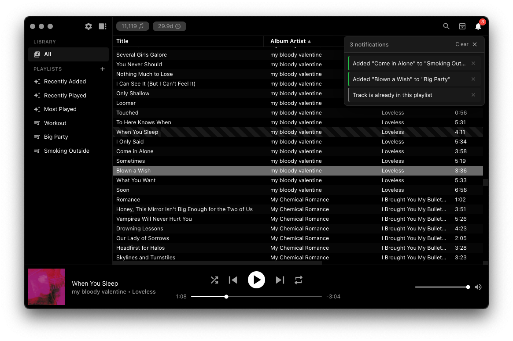
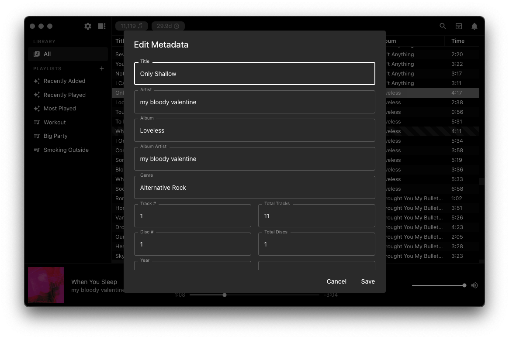

# hihat User Guide

This guide covers everything you can do inside hihat once it's installed and set up. For installation and first-time setup, see the [README](README.md).

## Table of Contents

1. [Playing Music](#playing-music)
2. [Sidebar and Navigation](#sidebar-and-navigation)
3. [Playlists](#playlists)
4. [Browsing and Filtering](#browsing-and-filtering)
5. [Notifications](#notifications)
6. [Mini Player](#mini-player)
7. [Editing Metadata](#editing-metadata)
8. [Right-Click Actions](#right-click-actions)
9. [Settings and Preferences](#settings-and-preferences)
10. [Keyboard Shortcuts](#keyboard-shortcuts)
11. [Tips](#tips)

## Playing Music

Double-click any track in the library to start playing. The player bar at the bottom of the window shows:

* **Album art** on the left (click to open the Mini Player)
* **Track title and artist** next to the album art (click the title to scroll back to the current song)
* **Playback controls** in the center: shuffle, previous, play/pause, next, and repeat
* **Seek slider** with elapsed and remaining time below the playback controls
* **Volume slider and mute button** on the right

## Sidebar and Navigation

The sidebar on the left is your main navigation:

* **All** — click to view your entire music library
* **Playlists** — your user-created playlists and smart playlists (marked with a sparkle icon)
* **Settings icon** (gear) — opens the Settings drawer
* **Toggle** — collapse or expand the sidebar with the toggle button, or press `Cmd+S`

## Playlists

**Creating a playlist:**
Click the **+** icon next to the "Playlists" header in the sidebar, type a name, and hit Create.

**Adding tracks to a playlist:**
Right-click any track and select **Add to Playlist**, then choose which playlist. You can also multi-select tracks (Cmd+Click or Shift+Click), right-click, and choose **Add All to Playlist**. Alternatively, drag and drop tracks directly onto any playlist in the sidebar.

**Smart playlists:**
Three built-in smart playlists update automatically:
* **Recently Added** — your 50 most recently imported tracks
* **Recently Played** — your 50 most recently played tracks
* **Most Played** — your 50 most played tracks

**Managing playlists:**
Right-click any user-created playlist in the sidebar to **Rename** or **Delete** it.

## Browsing and Filtering

The toolbar at the top of the track list holds all the tools for finding and organizing music: a search button, a browser button, and a notification button, all grouped at the right edge of the toolbar.

**Search:** Click the search button in the toolbar (or just start typing when focused on the library) to filter tracks by title, artist, album, or genre.

**Browser:** Click the browser button in the toolbar (next to search) to open the Browser panel at the top of the track list. It has two columns — Album Artist and Album — so you can drill down by artist and then by album. Click any item to filter; click it again to deselect.

**Sorting:** Click any column header to sort ascending or descending.

**Column visibility:** Right-click any column header to show or hide columns (Title, Artist, Album, Album Artist, Genre, Time, Play Count, Date Added, Last Played).

## Notifications

hihat shows quick, in-app notifications when things happen in the background — for example, when a track is added to a playlist, when metadata is saved, or when a file can't be written.

Click the **bell button** in the toolbar (at the far right, next to the browser button) to open the notification panel. A small badge appears on the bell whenever there are unread notifications. From the panel you can review recent notifications, dismiss them one by one, or clear them all at once. Click the bell again to close the panel.

## Mini Player

Click the album art in the player bar to open the Mini Player — a compact floating window that stays on top of other apps. It displays the album art as a full background with playback controls overlaid at the bottom. All controls work: play/pause, skip, previous, seek, volume, shuffle, and repeat.

## Editing Metadata

Right-click any track and select **Edit Metadata** to open the metadata editor. You can edit 13 fields:

* **Title**, **Artist**, **Album**, **Album Artist**, **Genre**
* **Track Number**, **Total Tracks**, **Disc Number**, **Total Discs**
* **Year**, **BPM**, **Composer**, **Comment**

When you click **Save**, hihat updates both its database and the actual audio file tags. This means your edits persist even if you re-scan your library or use the files in another music player.

**Supported formats for file tag writing:** MP3 (ID3), M4A/AAC (MP4 atoms), FLAC (Vorbis Comment), and OGG. Album art and any tags you don't edit are always preserved.

> **Note:** If hihat cannot write to the file (e.g. the file is on a read-only drive, or is in an unsupported format like WAV), your edits are still saved to the hihat database. You'll see a warning notification letting you know the file tags could not be updated.

## Right-Click Actions

Right-click any track to access:

* **Play** — play this track immediately
* **Add to Playlist** — add to any of your playlists
* **Edit Metadata** — edit track metadata and write changes back to the audio file
* **Show in Finder** — reveal the audio file in macOS Finder
* **Find on Spotify** — search for this track on Spotify
* **Find on Apple Music** — search for this track on Apple Music
* **Find on Tidal** — search for this track on Tidal
* **Download Album Art** — save the embedded album art as an image
* **Remove from Library** — remove the track from hihat and move the file to Trash

When viewing a playlist, the delete option becomes **Remove from Playlist** (the file stays in your library).

When multiple tracks are selected (Cmd+Click or Shift+Click), right-click to:
* **Add All to Playlist** — bulk add selected tracks
* **Remove from Library** — bulk remove selected tracks

## Settings and Preferences

Click the gear icon in the sidebar to open the Settings drawer:

* **Music Folder** — change where hihat looks for your music (triggers a full rescan)
* **Import Music** — add new songs or folders to your library
* **Rescan Library** — scan your existing library folder for new or changed files
* **Backup Library** — incremental backup to any external drive (only copies new and changed files)
* **Appearance** — toggle between Dark and Light themes
* **Column Visibility** — show or hide table columns (also available by right-clicking any column header)
* **Reset** — start fresh by clearing play counts, playlists, and settings. Your music files are never touched.

## Keyboard Shortcuts

| Action | Shortcut |
|--------|----------|
| Next Track | `Cmd+Right` |
| Previous Track | `Cmd+Left` |
| Volume Up | `Cmd+Up` |
| Volume Down | `Cmd+Down` |
| Toggle Shuffle | `Cmd+=` |
| Toggle Repeat | `Cmd+R` |
| Toggle Sidebar | `Cmd+S` |
| Toggle Full Screen | `Ctrl+Cmd+F` |

hihat also responds to **media keys** on your keyboard and **Bluetooth headphones**, and integrates with the **macOS Now Playing** widget for play/pause, skip, and previous controls.

## Tips

* Click the **song name** in the player bar to scroll back to the currently playing track
* Try **resizing the window** — hihat adapts to all sorts of sizes, including a compact view at narrow widths
* Use **Cmd+Click** or **Shift+Click** to select multiple tracks for bulk operations
* Check the **hihat** menu in the menu bar for library stats

(<a href="#user-guide-top">back to top</a>)

